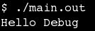
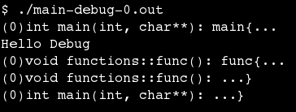
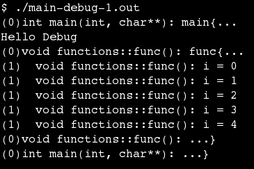
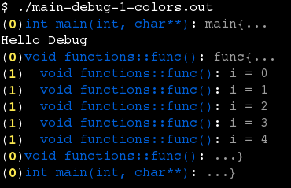
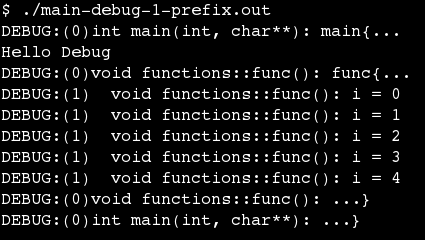

Simple C++ Debug Helper
=======================

**USAGE**

DEBUG(msg, depth)

prints a debug message if the depth is little than NDEBUG macro.

`msg` string message

`depth` depth level

**Everybody loves examples**

examples/main.cpp

```c++
/*
|Simple C++ DEBUG helper|
==================
Author: Gustavo Yudi Bientinezi Matsuzake (Helped by the internet)

Compile with -DDEBUG or define a DEBUG macro (#define DEBUG)
*/
#include <iostream>
#include <string>
#include "debug.hpp"

using namespace std;

namespace functions{
	void func(){
		DEBUG("func{...", 0);

		for(int i=0; i<5; i++)
			DEBUG("i = " << i, 1);
	

		DEBUG("...}", 0);
	}
}

int main(int argc, char* argv[]){
	DEBUG("main{...", 0);
	
	cout << "Hello Debug" << endl;	
	
	functions::func();

	DEBUG("...}", 0);
	return 0;
}
```

* Compiled without any macro



* Compiled with macro NDEBUG=0



* Compiled with macro NDEBUG=1



* Compiled with macro NDEBUG=1 and DEBUG\_COLOR\_ENABLE



* Compiled with macro NDEBUG=1 and DEBUG\_PREFIX\_ENABLE



* Compiled with macro N\_DEBUG=1 and DEBUG\_PREFIX\_ENABLE and DEBUG\_COLOR\_ENABLE


